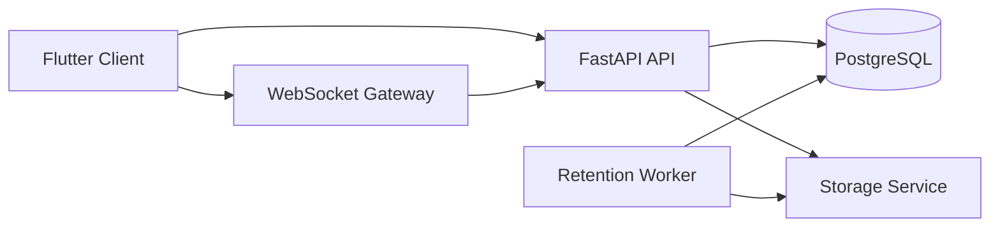

# Concord


A self-hosted, real-time community chat platform built with **Flutter + FastAPI**.

Concord focuses on core communication features: friends, servers, channels, messaging, image sharing, moderation, and voice channels.

## Highlights

- Unified app experience for regular users and platform admins
- Server/channel-based chat with direct messaging
- Image messaging with backend-managed retention
- Voice channels with live connection controls and status
- Self-hosted backend stack via Docker Compose
- Built-in role and moderation flows (owner/admin/member)

## Core Features

| Area | Implemented |
| --- | --- |
| Auth | Register, login, token refresh, handle format `username#0001` |
| Friends | Add/accept/remove, friend list, direct chats |
| Servers | Create/join/leave/delete, invites, bans, moderation logs |
| Channels | Create/rename/reorder/delete text and voice channels |
| Messages | Send/edit/delete, image messages, 1-year message retention |
| Files/Images | Upload pipeline, image payload cleanup after 7 days |
| Voice | Join/leave, mute/deafen, mic test, live status in top bar |
| Settings | User settings, theme/language/time format, voice/audio settings |
| Admin | Global visibility of servers/users with hidden presence behavior |

## System Architecture



## Repository Layout

- `lib/` Flutter client
- `lib/backend/` backend-connected client UI and API integration
- `backend/app/` FastAPI backend routes, services, models
- `backend/requirements.txt` backend dependencies
- `docker-compose.backend.yml` local/self-hosted backend stack
- `docs/` implementation and policy notes

## Quick Start

### 1) Flutter client

```bash
flutter pub get
flutter run
```

### 2) Backend stack (Docker)

```bash
cp .env.backend.example .env.backend
$env:POSTGRES_PORT='5433'; $env:API_PORT='8001'; docker compose --env-file .env.backend.example -f docker-compose.backend.yml up -d --build
```

API default for the app:

- `http://localhost:8001`

## Development Commands

```bash
flutter test
```

```bash
docker compose --env-file .env.backend.example -f docker-compose.backend.yml ps
```

## Data Retention Rules

- Chat history retention: **1 year**
- Uploaded image payload retention: **7 days**
- Server deletion cleanup: channels, messages, and related stored media are cleaned

## Current Product Direction

Concord is intentionally centered on practical communication workflows:

- Fast account onboarding
- Stable server + friend chat loops
- Strong moderation/admin controls
- Expandable voice system foundation

## Notes

- Voice/video screen sharing is not part of the current scope.
- The project is optimized for self-hosting and incremental feature expansion.

## License

This project is licensed under the MIT License. See [LICENSE](LICENSE).
